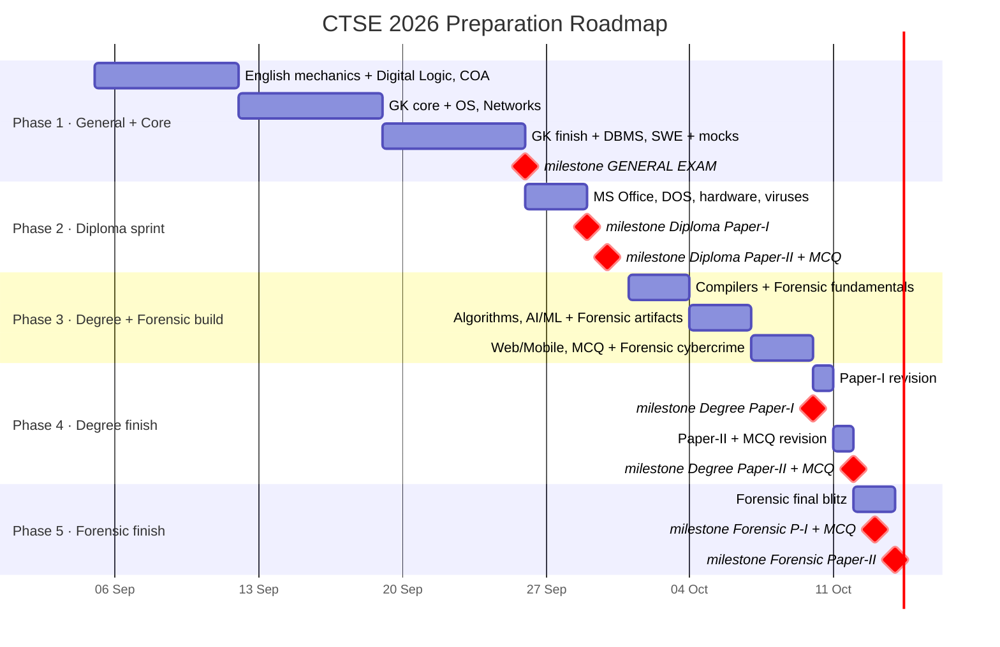
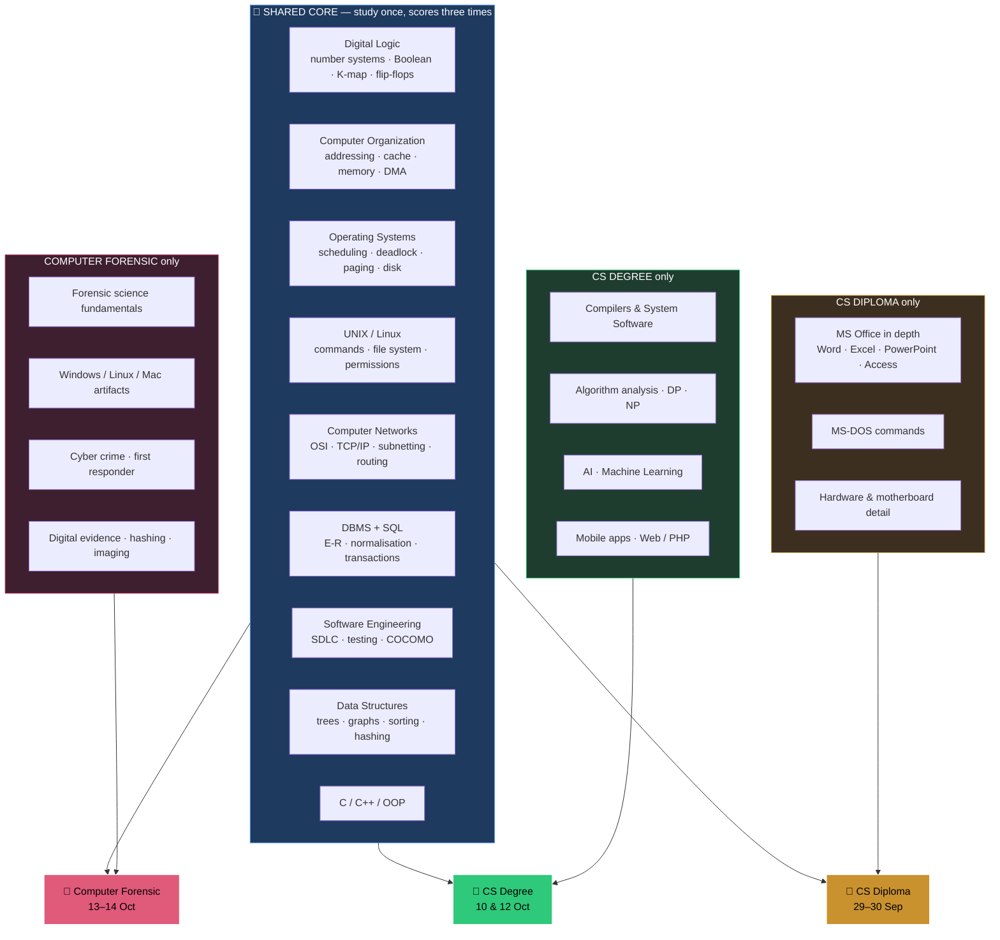
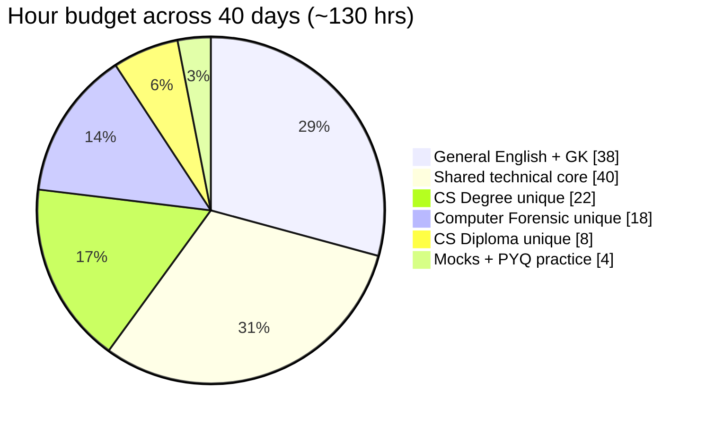
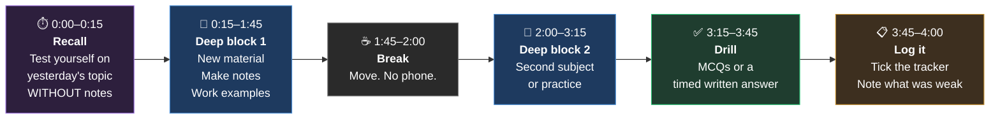

# CTSE 2026 — 40-Day Roadmap

**From:** 5 September 2026 · **To:** 14 October 2026 · **Budget:** 3–4 focused hours/day ≈ **130 hours total**

---

## The one-page strategy

You have three electives but you do **not** have three syllabi. Roughly **60% of the
technical content is shared** across Computer Forensic, CS (Degree) and CS (Diploma).
Study that shared core once and it pays into all three MCQ papers and all six
descriptive papers.

The whole plan follows from four constraints:

| Constraint | Consequence for the plan |
|---|---|
| General paper is **first** (26 Sep) and its 100 marks count toward **all three** posts | It gets top priority for the next 21 days. Highest leverage mark-for-mark in the whole exam. |
| MCQ is **200 marks** vs 100 per descriptive paper | MCQ drilling is not optional revision — it is 40% of every elective. Budget real time for it. |
| Descriptive papers offer **choice** (8 of 10, 3 of 5, 2 of 4) | You need ~70% syllabus depth, not 100%. Go deep on high-yield topics; deliberately abandon your two weakest per section. |
| Forensic exam (13–14 Oct) is only **1 day** after CS Degree finishes (12 Oct) | Forensic-unique content **must be learned during 1–9 Oct**, not left to the end. This is the #1 scheduling trap. |

---

## Phase map

---

## How the shared core pays into all three electives

**Read that diagram once a week.** Every hour spent in the blue box is an hour spent
on three exams at the same time. Every hour in a coloured box buys one exam only.

---

## Where the hours go

> Notice how small the CS Diploma slice is. As a B.Tech CSE graduate you already know
> almost all of that syllabus — **except** MS Office and MS-DOS, which you genuinely may
> not know and which the paper leans on heavily. That is the whole reason the Diploma
> slice is not zero.

---

# PHASE 1 — General + Core
### 5 – 25 September · 21 days · ~70 hours

**Daily rhythm: 2 hrs General · 1.5 hrs Shared Core**

General comes first because it is the first exam and because its 100 marks are counted
into all three of your post evaluations. The shared core runs underneath it every day so
that by the time the technical exams arrive you are revising, not learning.

### Week 1 · 5–11 Sep — English mechanics + hardware-side core

| Slot | Focus |
|---|---|
| **General (2 hrs)** | Essay structure and practice · précis method · amplification method · grammar high-yield rules. **Write 1 full essay every 2 days, by hand, timed.** |
| **Core (1.5 hrs)** | `CORE_01_DigitalLogic` · `CORE_02_ComputerOrganization` |

**Week 1 targets:** 4 essays written by hand · 2 précis · 3 amplifications · Digital Logic and COA complete with worked numericals.

### Week 2 · 12–18 Sep — GK core + systems core

| Slot | Focus |
|---|---|
| **General (2 hrs)** | Indian Polity (**Article 371A is near-certain — know it cold**) · Indian History · **Nagaland & North-East GK** (highest-yield, least-prepared area) |
| **Core (1.5 hrs)** | `CORE_03_OperatingSystems` · `CORE_05_ComputerNetworks` |

**Week 2 targets:** Polity + Nagaland GK done and self-tested · OS scheduling/paging numericals fluent · subnetting fluent.

### Week 3 · 19–25 Sep — GK finish + data core + mocks

| Slot | Focus |
|---|---|
| **General (2.5 hrs)** | Economy · Geography · General Science · **Mental Ability** (learn the shortcuts) · Current Affairs revision · **2 full 3-hour mock papers under exam conditions** |
| **Core (1 hr)** | `CORE_06_DBMS` · `CORE_07_SoftwareEngineering` |

**Week 3 targets:** 2 full timed General mocks completed and reviewed · mental ability shortcuts automatic · GK capsule revised twice.

### 25 Sep — day before
Light revision only. Essay skeletons, amplification structures, Nagaland GK, mental
ability shortcuts. Sleep early. **No new material.**

---

# PHASE 2 — Diploma sprint
### 26 – 30 September · ~4 days

> 🎯 **This phase is almost entirely MS Office and MS-DOS.** Everything else in the
> Diploma syllabus you already know from your degree. Do not waste this window
> re-reading networking basics — go straight at the things you don't know.

| Day | Plan |
|---|---|
| **26 Sep** (after General exam) | Rest the afternoon. Evening: start `CSDip_02_MSOffice_and_DOS` — MS Word + Mail Merge. |
| **27 Sep** | MS Excel (formulas, absolute vs relative referencing, function syntax, charts) · MS PowerPoint · MS Access · **Diploma MCQ drill** |
| **28 Sep** | MS-DOS internal vs external commands · BAT/EXE/COM · Windows accessories · hardware & motherboard facts · viruses · **full Diploma MCQ mock** |
| **29 Sep** | Morning: light revision of Paper-I topics only. **13:00–16:00 Paper-I.** Evening: Paper-II topics (OS, UNIX, DBMS, SAD, C) — these you know, just refresh. |
| **30 Sep** | **09:00–12:00 Paper-II · 13:00–15:00 MCQ.** |

---

# PHASE 3 — Degree + Forensic build
### 1 – 9 October · 9 days · ~35 hours

> ⚠️ **The critical phase.** Forensic sits one day after CS Degree ends, so there is no
> room to learn it later. Forensic-unique material gets a daily slot here or it does not
> get learned at all.

**Daily rhythm: 2.5 hrs CS Degree unique · 1.5 hrs Forensic unique**

| Days | CS Degree track | Forensic track |
|---|---|---|
| **1–3 Oct** | `CSD_02` System Software & Compilers — assemblers, loaders, linkers, compiler phases, FIRST/FOLLOW, parsing | `FOR_01` Forensic science fundamentals — Locard's principle, physical evidence, chain of custody, crime scene, Indian FSL structure |
| **4–6 Oct** | `CSD_01` Algorithms — complexity, D&C, greedy, DP, NP-completeness · `CSD_03` AI — search, A*, logic, resolution | `FOR_02` System artifacts — Windows registry, slack space, ADS, event logs, Linux & Mac artifacts |
| **7–9 Oct** | `CSD_03` Machine Learning — kNN, K-means, ensembles · `CSD_04` Mobile & Web/PHP · **CS Degree MCQ drills** | `FOR_03` Cyber crime, first responder, order of volatility, imaging & hashing, **email header analysis**, browser forensics |

**Phase 3 exit criteria — be honest with yourself on 9 Oct:**
- [ ] Compiler phases + FIRST/FOLLOW: can do from memory
- [ ] DP worked examples (knapsack, LCS): can reproduce the tables
- [ ] A* and K-means: can work a numerical example
- [ ] Order of volatility: memorised in order
- [ ] Chain of custody + Locard: can write a 10-mark answer
- [ ] Email header trace: can walk through one

---

# PHASE 4 — Degree finish
### 10 – 12 October

| Day | Plan |
|---|---|
| **10 Oct** | Morning: revise Paper-I topics — programming, data structures, logic design, COA, compilers, mobile. **13:00–16:00 Paper-I.** Evening: rest. |
| **11 Oct** | **Full free day — use it.** Morning: Paper-II revision (OS, SWE, DBMS, networks, web, AI, ML). Afternoon: **full CS Degree MCQ mock, timed, 100 questions in 2 hours.** Evening: review mistakes only. |
| **12 Oct** | **09:00–12:00 Paper-II · 13:00–15:00 MCQ.** Evening: **switch hard to Forensic** — Paper-I topics and MCQ blitz. |

---

# PHASE 5 — Forensic finish
### 12 – 14 October

| Day | Plan |
|---|---|
| **12 Oct evening** | Forensic Paper-I blitz: forensic science fundamentals, physical evidence, crime scene, artifacts, logic/networks/OS/COA (already known from core). Skim `FOR_05` MCQs. |
| **13 Oct** | **09:00–12:00 Paper-I · 13:00–15:00 MCQ.** Evening: Forensic Paper-II blitz — cyber crime, browsers & email, digital evidence, mobile forensics, plus SWE/C/DBMS/DS from core. |
| **14 Oct** | **09:00–12:00 Paper-II.** Done. 🎉 |

---

## The daily rhythm that makes 3–4 hours actually work

### Five rules that matter more than the schedule

1. **Start every session by recalling yesterday's material from memory, before opening
   any notes.** Retrieval practice is worth several times more than re-reading. If you
   change one thing about how you study, change this.

2. **Write answers by hand, timed.** These are handwritten 3-hour papers. Reading an
   answer and writing an answer are different skills, and only one of them is examined.
   You must know what a 5-mark answer *feels* like in length before exam day.

3. **Never leave a worked numerical un-worked.** Scheduling, page replacement,
   subnetting, normalisation, K-maps, DP tables, entropy — these are where 10- and
   15-mark answers come from, and you cannot bluff them.

4. **Drill MCQs continuously, not at the end.** 200 marks. Every day should end with
   at least 20 questions.

5. **If a day goes wrong, do not try to make it up.** Skip ahead to the scheduled topic
   and carry on. A plan you fall behind on and abandon is worse than a plan you follow
   at 80%.

---

## Risk register — what could go wrong

| Risk | Likelihood | Mitigation |
|---|---|---|
| **Forensic gets squeezed out** because CS Degree feels more familiar | High | The 1.5 hr/day Forensic slot in Phase 3 is non-negotiable. Tick it in the tracker. |
| **GK feels bottomless**, you keep reading and never test | High | Hard-stop GK reading on 22 Sep. The last 4 days are testing and revision only. |
| **Essay never practised**, only "planned" | High | 20 marks. Write one every 2 days by hand from Week 1. No exceptions. |
| **MS Office dismissed as trivial**, then the Diploma MCQ punishes you | Medium | It is worth ~30–40 MCQ marks. Treat it as a real subject on 26–28 Sep. |
| Burnout across a 19-day exam window | Medium | Phase 2 and 5 are deliberately short and sharp. Sleep is part of the plan. |
| **NPSC changes the dates** | Medium | Three corrigenda have already been issued. Check the site weekly. |
